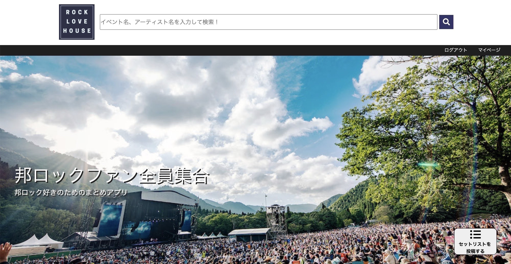
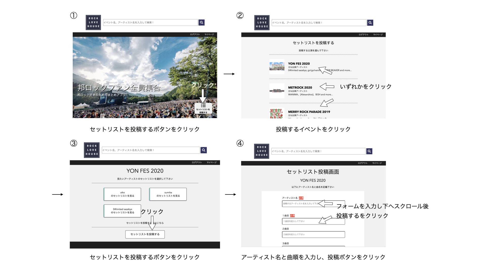
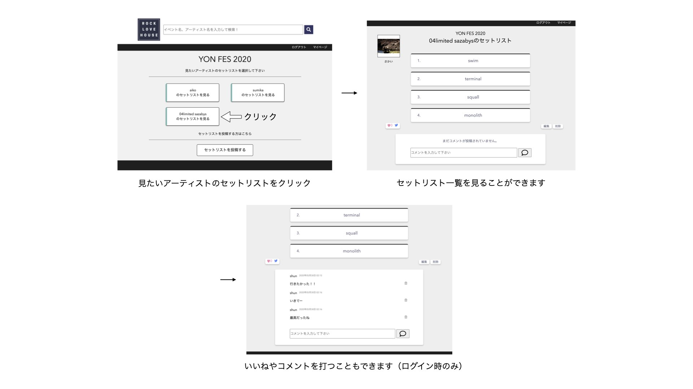

 

# Name
ROCK LOVE HOUSE

 

# Description
音楽イベントでの体験や思い出の共有をサポートするアプリです。
具体的には音楽イベントでのセットリスト（アーティストが演奏した曲順）を投稿することができ、それを見ることができます。

 

# Usage
1.　[ROCK LOVE HOUSE](18.176.181.203)のアドレスへ遷移します。  
2.　新規登録をしてください。  
3.　セットリスト投稿をするには以下の手順を行って下さい。  

4.　投稿されたセットリストを見るには以下の手順を行って下さい。

#### テスト用アカウントを用意しておりますので、動作確認等にご利用下さい。  
メールアドレス：test_user@sample.com  
パスワード：passpass

 

# Furture
今後は、InstagramやTwitterに投稿するのを助けるイベントごとの画像投稿機能や、定価でのイベントチケット取引ができる機能を実装する予定です。

 

# Licence
This software is released under the MIT License, see LICENSE.

 

# Author
Shun Sakai  
twitter https://twitter.com/sakai_1910  
GitHub https://github.com/shun0211  
